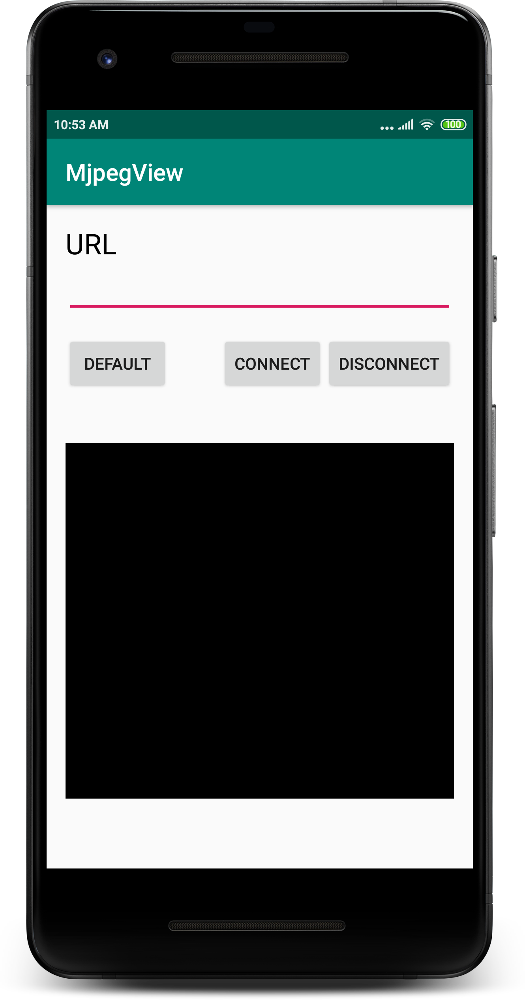
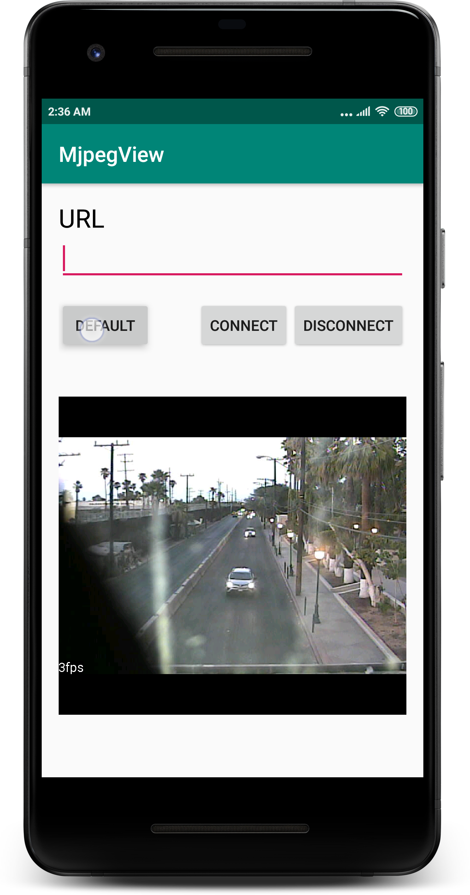
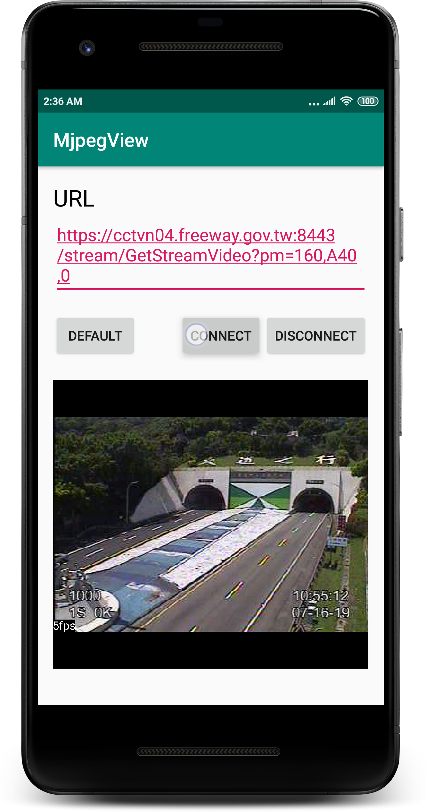

# MjpegView<a href='https://play.google.com/store/apps/details?id=example.yangping.mjpegview'></a>

MJPEG video streaming on Android.

This library reference by the post of [stackoverflow](https://stackoverflow.com/questions/3205191/android-and-mjpeg).

Sample
===





Methods
===

| Name | Return | Definition |
| :---:   | :-:  | :-:  |
| setFPSEnable(boolean enable) | void | Set whether to display fps text. |
| startPlayback(String url) | void | Start the video streaming. |
| startPlayback(MjpegInputStream inputStream) | void | Start the video streaming. |
| stopPlayback() | void |  Stop the video streaming. |
| setOnMjpegCompletedListener(OnMjpegCompletedListener listener) | void | Set the Listener.|

XML
===
```
    <com.yangping.mjpeg.MjpegView
            android:layout_width="match_parent"
            android:layout_height="300dp"/>
```

Code
===
Play the video streaming by the inputstream.
```
 mjpegView.startPlayback(new MjpegInputStream(inputStream));
```
Play the video streaming by the string.
```
 mjpegView.startPlayback(url);
```

OnMjpegCompletedListener
===
```
 public interface OnMjpegCompletedListener {
        //Call this method When the inputsteam have finished reading the data.
        void onCompeleted();
        //Call this method When catch an error.
        void onFailure(@NonNull String error);
}
```

Download
========
```xml
<dependency>
  <groupId>com.yangping</groupId>
  <artifactId>mjpegview</artifactId>
  <version>1.0.3</version>
  <type>pom</type>
</dependency>
```
or Gradle ( jcenter ):
```groovy
implementation 'com.yangping:mjpegview:1.0.3'
```

### License
```
Copyright 2019 zih-yang lin

Licensed under the Apache License, Version 2.0 (the "License");
you may not use this file except in compliance with the License.
You may obtain a copy of the License at

   http://www.apache.org/licenses/LICENSE-2.0

Unless required by applicable law or agreed to in writing, software
distributed under the License is distributed on an "AS IS" BASIS,
WITHOUT WARRANTIES OR CONDITIONS OF ANY KIND, either express or implied.
See the License for the specific language governing permissions and
limitations under the License.
```
